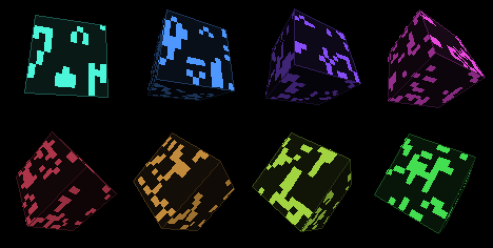

# Game of Life on a bouncing 3D cube — ESP32-C5-LCD-1.47

Conway's Game of Life running on the *surface* of a 3D cube that tumbles on all
three axes and bounces around the screen, on the
[Waveshare ESP32-C5-LCD-1.47](https://github.com/waveshareteam/esp32-c5-lcd-1.47)
(1.47" 172x320 ST7789, driven landscape at 320x172).



*(Host-rendered preview, using the same projection, shading and palette math as
the sketch. Each panel shows a different hue, as if each were a fresh reseed.)*

**[Video: the cube running on the board](https://youtu.be/m2hgfxZ1nVk)**

## What it does

- **Life on a closed surface.** The six 12x12 faces are one connected 864-cell
  world, not six independent grids. Patterns crawl over face edges and around
  corners instead of dying against a frame — the cube has no boundary.
- **Tumbles and bounces.** Perspective-projected, spinning on three
  deliberately incommensurate axes so the orientation never repeats, drifting
  DVD-logo style and bouncing off the screen edges.
- **Runs forever unattended.** Reseeds automatically when the population dies
  out, settles into a repeating cycle (rolling hash of the last 12
  generations), or hits a generation cap.
- **A new colour on every reseed.** Cells, edges and face backdrop all shift
  together, so the cube stays one object rather than a colour clash.
- **Per-face Lambert shading** plus an edge outline, so the faces read as a
  solid object rather than three flat quads.

Life advances on its own ~170 ms clock while the cube keeps spinning at 60 fps
in between, so the animation stays smooth without the simulation racing.

Reseeds land anywhere from ~10 s to ~90 s apart, depending entirely on how long
that particular seed takes to find a cycle. 864 cells is a small closed world,
so it settles fairly quickly. That's the simulation working, not a bug. If you
want longer runs, raise `N` — don't shrink `HASH_RING_LEN`, which just leaves it
sitting in an undetected oscillator, which looks worse.

## Repository layout

```
life-cube/            <- repo root; run arduino-cli from here
  README.md
  LICENSE
  life_cube/
    life_cube.ino     <- the whole sketch, no other source files
    preview.png
```

The sketch lives one level down because arduino-cli requires the sketch
directory name to match the `.ino` basename. Keeping it nested means the repo
itself can be cloned under any name without breaking the build.

## Requirements

- **Hardware:** Waveshare ESP32-C5-LCD-1.47. No wiring — the panel, backlight
  and onboard WS2812 pins are hard-coded to the board's own.
- **`esp32:esp32` Arduino core >= 3.3.11** — that release adds the `esp32c5`
  target. `arduino-cli core install esp32:esp32`.
- **Arduino_GFX (`GFX Library for Arduino`) 1.6.5** — the version this is
  built and verified against; either route below.
- [`arduino-cli`](https://arduino.github.io/arduino-cli/) — everything here is
  CLI, but the sketch builds fine from the Arduino IDE too.

### Getting Arduino_GFX

Either install it from the library index:

```sh
arduino-cli lib install "GFX Library for Arduino"@1.6.5
```

…or point the build at the copy vendored in the board's own repo, which is what
this sketch was developed against:

```sh
git clone https://github.com/waveshareteam/esp32-c5-lcd-1.47
# then add: --libraries esp32-c5-lcd-1.47/libraries
```

The two are the same code — the vendored 1.6.5 tree is byte-identical to the
published 1.6.5 apart from line endings, and both produce the same binary. Use
the clone if you also want the board's hardware reference and its other
examples.

## Building

From the **repo root** (the directory holding this README):

```sh
FQBN="esp32:esp32:esp32c5:UploadSpeed=921600,CDCOnBoot=cdc,CPUFreq=240,FlashFreq=80,FlashMode=qio,FlashSize=4M,PartitionScheme=huge_app,DebugLevel=none,PSRAM=disabled,EraseFlash=none,JTAGAdapter=default,ZigbeeMode=default"

# compile only
arduino-cli compile --fqbn "$FQBN" life_cube

# compile and flash
arduino-cli board list                       # find your port
arduino-cli compile -u -p /dev/cu.usbmodem3101 --fqbn "$FQBN" life_cube
```

Add `--libraries <path-to>/esp32-c5-lcd-1.47/libraries` to either command if you
went the vendored-library route instead of `lib install`.

Flash usage is 12% (402,888 bytes); static RAM is 36,640 bytes, and the sketch
reports ~249 KB of heap still free at runtime after the sprite is allocated.

## Watching it run

```sh
arduino-cli monitor -p /dev/cu.usbmodem3101 -c baudrate=115200
```

Serial carries boot diagnostics plus a line per reseed — deliberately *not* a
periodic frame-rate log, since that is what used to stall this loop (see the
gotcha below). Frame timing rides along on the reseed line, which was printing
anyway:

```
sprite 112x112 (25088 bytes), free heap 249420
topology: 864 cells, 0 symmetry fixups
  degree 7: 24 cells  (cube corners)
  degree 8: 840 cells
palette: hue=260 rgb=138,79,255
gen=87 live=36 reason=cycle-detected max_frame_gap=20ms
palette: hue=20 rgb=255,138,79
```

`max_frame_gap` is the longest gap between two frames since boot — a stall
detector riding on a line that was printing anyway. It should sit just above the
16.7 ms frame budget; anything near 2000 ms means a USB CDC write is blocking
the loop again.

With a zero TX timeout, log lines are *dropped* when the ring is full rather
than queued, so a long unattended run may show nothing until the next reset.
That is the fix working: frames are kept, log lines are sacrificed.

## How the cube-surface topology works

Face `f` covers axis `f/2` at sign `f&1 ? -1 : +1`, with in-plane axes
`u = (axis+1)%3` and `v = (axis+2)%3`. To find a cell's neighbours, the sketch
probes one cell-width out in each of the 8 directions and folds the resulting 3D
point back onto the cube with a **cube-map lookup** — the largest-magnitude
component picks the face, and dividing through by it gives the coordinates on
that face. A probe that walks off an edge lands on the adjacent face at the
correct distance from the shared edge, and this falls out of the arithmetic
rather than needing 24 hand-written edge-adjacency cases.

At a cube corner the diagonal probe is a genuine argmax tie, which could in
principle make adjacency one-way (A is B's neighbour but not vice versa) —
harmless-looking but it would quietly corrupt Life near the edges. The table is
therefore explicitly symmetrised at boot and the degree histogram printed:

```
topology: 864 cells, 0 symmetry fixups
  degree 7: 24 cells  (cube corners)
  degree 8: 840 cells
```

24 cells at degree 7 is correct — 8 geometric corners, 3 faces meeting at each.
Anything else in that histogram means the topology is wrong.

## Colour

`roll_palette()` randomises the **hue** only, holding saturation and value at
the values of the original mint-green palette — bright cells (`v=1.0`), a
mid-tone edge (`v=0.35`) and a barely-lit face backdrop (`v=0.10`), all sharing
one hue.

Rotating hue at fixed S/V is deliberate: picking raw random RGB would regularly
land on muddy or near-black cells that read badly on this panel, whereas every
point on the hue wheel at these S/V values is legible. Consecutive hues are also
forced at least 60 degrees apart, or a reseed can land on a near-identical
colour and look like nothing happened. The rejection loop costs ~1.5 draws on
average (verified over 200k rolls, worst case 12).

The roll is logged from inside `roll_palette()` rather than at the call site, so
it can't report a palette that is on its way out.

## Rendering

The cube is drawn into a **112x112 offscreen sprite canvas** (25 KB) that is
blitted at the cube's current position, rather than a full-screen framebuffer
(110 KB — this board has no PSRAM). The previous frame's leftovers are erased
with two thin strips rather than a full clear.

`PROJ_SCALE` was fixed by sweeping 216,000 orientations on the host and taking
the worst-case projected corner (`max |X/(CAM_D-Z)| = 0.4804`), giving 53.8 px
against a 56 px half-sprite — the cube provably never clips its own sprite.

Only the 1–3 front-facing faces are drawn, culled with an exact perspective
backface test, so no depth sorting or Z-buffer is needed.

Uncapped, render + blit measures **~175 fps**; the loop paces itself to 60 and
integrates motion against measured elapsed time, so spin and drift speed do not
depend on frame rate.

Nothing is drawn on the panel but the cube — no overlay, no counter. Frame
timing goes over serial, where it can't distract from the thing you're actually
watching.

## Gotcha: USB CDC logging will freeze the animation

`Serial.setTxTimeoutMs(0)` in `setup()` is load-bearing, not tidying.

On USB CDC, `write()` blocks for up to `max_consec_timeouts` (20) x
`tx_timeout_ms` (100) = **2 seconds** once the TX ring buffer fills. The ring
fills whenever the board is plugged into a host that isn't draining the port —
which is the normal case for this sketch, since you're watching the panel, not
a terminal. `isPlugged()` stays true, so the core correctly reads it as host
backpressure and waits it out. The symptom is the render loop freezing
mid-tumble at exactly the period of the log line, then resuming as if nothing
happened. It does *not* reproduce with a serial monitor attached, because then
the port is being drained.

A zero TX timeout makes writes drop instead of wait — log lines are
best-effort, frames are not.

`if (Serial)` is **not** a workaround: it reports `isCDC_Connected()`, which
stays true under backpressure. Any long-running sketch on this board that logs
periodically wants the same one-liner.

## Tuning

| Constant | Effect |
| --- | --- |
| `N` | Cells per face edge (12). **This is the knob for reseed churn** — a bigger world takes longer to settle. Costs `6*N*N` bytes x3 plus a bigger neighbour table, and shrinks cells below the ~6 px they currently get. |
| `SPRITE` | Sprite size. If you change it, re-derive `PROJ_SCALE` (`0.4804 * SPRITE` is the fit limit) or the cube will clip. |
| `SPIN_*_RAD_S` / `DRIFT_*_PX_S` | Tumble and bounce speed, in units per second. |
| `TARGET_FPS` | Frame cap (60). Motion is time-based, so changing this alters smoothness and power draw, not speed. |
| `GENERATION_INTERVAL_MS` | Life tick rate, independent of frame rate. |
| `SEED_DENSITY_PCT` | Initial live fraction. |
| `HASH_RING_LEN` | Cycle-detection depth (12) — catches oscillators up to that period. |
| `STAGNATION_HOLD_MS` | How long the final state stays up, still spinning, before reseeding. |

## License

MIT — see [LICENSE](LICENSE). Display and WS2812 pin assignments follow the
Apache-2.0 licensed [Waveshare board
repo](https://github.com/waveshareteam/esp32-c5-lcd-1.47); Arduino_GFX is
BSD-licensed and is not vendored here.
